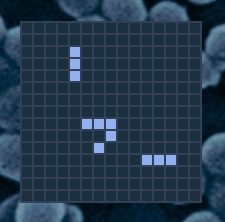

# Game of Life

This project is an implementation of the classic Conway's Game of Life with multiple enhancements.

## Table of contents

- [Overview](#overview)
  - [The challenge](#the-challenge)
  - [Screenshot](#screenshot)
- [My process](#my-process)
  - [Built with](#built-with)
  - [What I learned](#what-i-learned)
  - [Continued development](#continued-development)
  - [Useful resources](#useful-resources)
- [Author](#author)
- [Acknowledgments](#acknowledgments)

## Overview

### The challenge

The basic Game of Life algorithm has been enhanced in multiple ways:

- Streamlined DOM updates, so that instead of rebuilding the entire grid which crashed the browser after extended runs, only the 'live' class is toggled for changed cells. This reduced the memory and CPU load on the browser, enabling the simulation to run continuously, much faster, and with larger girds.
- Enabled random fills of the grid. After some experimentation 20% live cells seems to provide a good balance between enough cells to propogate with enough space for them to move well.
- Enabled detection of static configurations where no cells are changing or they are only flipping back and forth. When this occurs, a checkbox allows the system to start over with a new random fill. This allows the discovery of perpetually moving patterns like gliders: https://en.wikipedia.org/wiki/Glider_(Conway%27s_Game_of_Life)
- Enabled variable grid size.
- Enabled variable regeneration speeds.
- Added a clear button to erase the grid.
- Enhanced the styling with collapsible, sliding setup controls and an interesting MRSA bacteria electron micrograph background.

### Screenshot

A 15x15 grid with a glider and two flippers that will run continously

## My process

### Built with

- Semantic, accessible HTML5 markup
- CSS custom properties including flexbox
- JavaScript event handling and data manipulation

### What I learned

The biggest challenge with this program were browser limitations. The original version crashed the browser after an extended run, due to increasing tab memory usage. I was able to refactor the code to minimize DOM update by only toggling a 'live' class to show the live/dead cells instead of re-building the elements of the grid.

### Useful resources

- [Conway's Game of Life](https://en.wikipedia.org/wiki/Conway's_Game_of_Life) - The Game of Life is a cellular automaton devised by the British mathematician John Horton Conway in 1970. It is a zero-player game, meaning that its evolution is determined by its initial state, requiring no further input. One interacts with the Game of Life by creating an initial configuration and observing how it evolves.

## Author

David Fiel

- Website - [David Fiel](https://fiel.us)

## Acknowledgments

The basic skeleton is from the Udemy course "Test Driven Development using Javascript and Jest." by Mark Robson: https://www.udemy.com/course/test-driven-development-using-javascript-and-jest/

Thanks to Alex for the CRC32 code used to check for repeating patterns: https://stackoverflow.com/questions/18638900/javascript-crc32

Thanks to Nurul Huda for the CSS sliding div reveal tags: https://stackoverflow.com/questions/24314687/slide-down-animation-from-displaynone-to-displayblock/70880010#comment140446272_70880010
